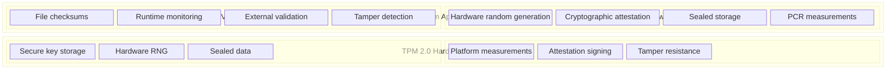
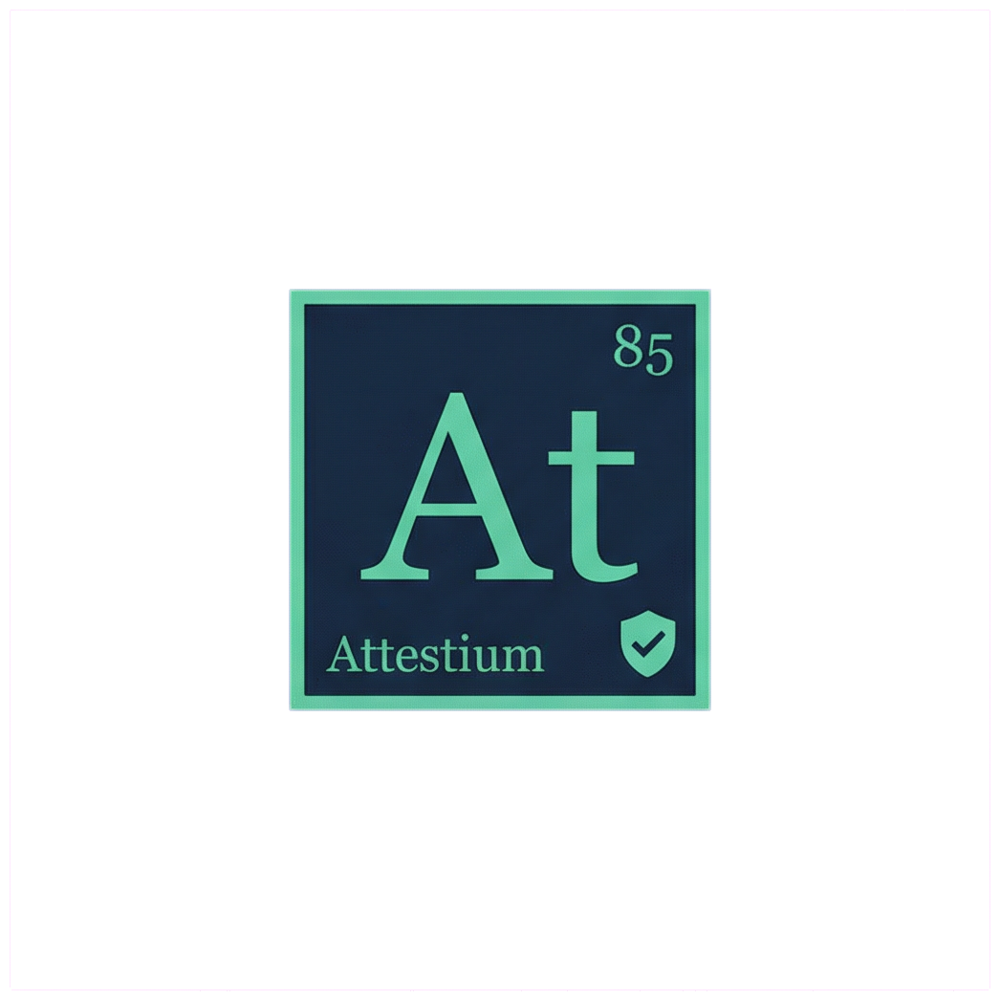

# Attestium


[](https://github.com/attestium/attestium/actions/workflows/ci.yml)
[](https://badge.fury.io/js/attestium)
[](https://opensource.org/licenses/MIT)
[](https://nodejs.org/)
[](https://github.com/attestium/attestium/actions)
[](https://trustedcomputinggroup.org/)

📄 **[Read the Technical Whitepaper](./attestium-whitepaper.pdf)** — 19 pages covering our architecture, security model, TPM 2.0 integration, and adoption roadmap.

> **Element of Attestation** - Runtime code verification and integrity monitoring for Node.js applications

<a href="https://forwardemail.net">
  
</a>

**Attestium is a project by [Forward Email](https://forwardemail.net) – the 100% open-source, privacy-focused email service.**

We created Attestium to provide transparent, hardware-backed proof of our own server-side code integrity. We believe in open, verifiable systems, and Attestium is our contribution to a more trustworthy internet.

## 🧪 **What is Attestium?**

Attestium is a **runtime code verification and integrity monitoring library** that provides cryptographic proof of your application's code integrity. Like an element in the periodic table, Attestium represents the fundamental building block of **attestation** - the ability to prove that your code is running exactly as intended, without tampering or modification.

### **Core Concept: Element of Attestation**

Just as chemical elements have unique properties and atomic structures, Attestium provides:

* **Symbol**: `At` (for Attestation)
* **Atomic Properties**: Stable verification states, tamper-reactive bonds
* **Chemical Reactions**: Cryptographic verification processes
* **Molecular Structure**: File checksums linked by cryptographic bonds

## 🎯 **Why Attestium Exists**

### **The Problem: Trust in Distributed Systems**

In today's world of cloud computing and distributed systems, users need to trust that:

* The code running on servers matches what's published in repositories
* No unauthorized modifications have been made to running applications
* Third parties can independently verify system integrity
* Changes to code are immediately detectable

### **Research Background**

Attestium was developed based on extensive research into existing solutions and their limitations. This research was inspired by:

* **[Forward Email Technical Whitepaper](https://forwardemail.net/technical-whitepaper.pdf)** - Requirements for transparent, auditable email infrastructure
* **[Mullvad System Transparency](https://mullvad.net/media/system-transparency-rev4.pdf)** - Approaches to system transparency and verification

> \[!NOTE]
> **Research Foundation**: Attestium addresses the specific need for runtime code verification that emerged from Forward Email's commitment to transparency and Mullvad's pioneering work in system transparency.

## 🔍 **Comprehensive Analysis of Existing Solutions**

Before developing Attestium, we conducted extensive research into existing verification, attestation, and integrity monitoring solutions. This comprehensive analysis examines 20+ solutions across different categories to understand their capabilities, limitations, and suitability for runtime code verification.

| **Solution** | **Primary Purpose** | **Runtime Verification** | **Third-Party APIs** | **Hardware Requirements** | **Complexity** | **Cost** | **Node.js Integration** | **Application Focus** | **Continuous Monitoring** | **Description** | **Notes** |
|----------|----------|---------------------|------------------|-------------------|---------------------|------|-------------------|------------------|---------------------|-------------|-------|
| **[Attestium](https://github.com/attestium/attestium)** | Runtime Verification | ✅ Yes | ✅ Yes | ✅ TPM 2.0 Required | 🟢 Low | 🟢 Free | ✅ Native | ✅ Yes | ✅ Yes ([Audit Status](https://auditstatus.com)) | Hardware-backed runtime code verification for Node.js applications with TPM 2.0 integration | Our solution - addresses gaps in existing tools with hardware security |
| **[SigSum](https://www.sigsum.org/)** | Transparency Logging | ❌ No | ✅ Yes | ❌ No | 🟡 Medium | 🟢 Free | ❌ No | ❌ No | ⚠️ Log Only | Minimal design for public transparency logs of signed checksums with witness verification | Excellent for transparency but no runtime verification |
| **[SigStore](https://www.sigstore.dev/)** | Code Signing | ❌ No | ⚠️ Limited | ❌ No | 🟡 Medium | 🟢 Free | ⚠️ Limited | ❌ No | ❌ No | Keyless code signing for software supply chain security with transparency logs | Build-time signing only, no runtime capabilities |
| **[Keylime](https://keylime.dev/)** | Remote Attestation | ⚠️ Limited | ✅ Yes | ✅ TPM Required | 🔴 High | 🟢 Free | ❌ No | ⚠️ Limited | ⚠️ Limited | Remote attestation framework using TPM for hardware-backed verification | Infrastructure-focused, requires specialized hardware |
| **[Intel TXT](https://www.intel.com/content/www/us/en/support/articles/000025873/technologies.html)** | Hardware Attestation | ❌ No | ⚠️ Limited | ✅ Intel CPU | 🔴 High | 🟡 Hardware | ❌ No | ⚠️ Boot Only | ❌ No | Hardware-based platform attestation with measured boot process | Boot-time only, no application-level verification |
| **[AMD SVM](https://developer.amd.com/sev/)** | Hardware Attestation | ❌ No | ⚠️ Limited | ✅ AMD CPU | 🔴 High | 🟡 Hardware | ❌ No | ⚠️ Boot Only | ❌ No | Hardware virtualization security with memory encryption | Limited to virtualization security |
| **[ARM TrustZone](https://www.arm.com/technologies/trustzone-for-cortex-a)** | Hardware Attestation | ⚠️ Limited | ⚠️ Limited | ✅ ARM CPU | 🔴 High | 🟡 Hardware | ❌ No | ⚠️ Limited | ❌ No | Hardware security architecture with secure/non-secure worlds | ARM-specific, complex development |
| **[Intel SGX](https://www.intel.com/content/www/us/en/developer/tools/software-guard-extensions/overview.html)** | Secure Enclaves | ⚠️ Enclave Only | ⚠️ Limited | ✅ Intel CPU | 🔴 High | 🟡 Hardware | ❌ No | ⚠️ Enclave Only | ⚠️ Limited | Secure enclaves for protected code execution with remote attestation | Being deprecated, limited memory |
| **[AWS Nitro Enclaves](https://aws.amazon.com/ec2/nitro/nitro-enclaves/)** | Cloud Attestation | ⚠️ Limited | ⚠️ Limited | ✅ AWS Only | 🟡 Medium | 🔴 Expensive | ❌ No | ⚠️ Limited | ❌ No | Isolated compute environments with cryptographic attestation | AWS-only, expensive for continuous use |
| **[Google Asylo](https://asylo.dev/)** | Secure Enclaves | ⚠️ Enclave Only | ⚠️ Limited | ✅ SGX/TrustZone | 🔴 High | 🟢 Free | ❌ No | ⚠️ Enclave Only | ❌ No | Framework for confidential computing across multiple TEE technologies | Complex development, limited ecosystem |
| **[Microsoft VBS](https://docs.microsoft.com/en-us/windows-hardware/design/device-experiences/oem-vbs)** | Virtualization Security | ⚠️ Limited | ❌ No | ✅ Windows Only | 🟡 Medium | 🟡 Windows | ❌ No | ⚠️ Limited | ❌ No | Windows security using hypervisor isolation for code integrity | Windows-only, limited cross-platform support |
| **[Docker Content Trust](https://docs.docker.com/engine/security/trust/)** | Container Signing | ❌ No | ❌ No | ❌ No | 🟡 Medium | 🟢 Free | ❌ No | ❌ No | ❌ No | Container image signing and verification with role-based delegation | Container-focused, no runtime verification |
| **[Notary](https://github.com/notaryproject/notary)** | Content Signing | ❌ No | ⚠️ Limited | ❌ No | 🟡 Medium | 🟢 Free | ❌ No | ❌ No | ❌ No | Framework for publishing and managing trusted collections of content | Generic signing, no application-specific features |
| **[Cosign](https://github.com/sigstore/cosign)** | Container Signing | ❌ No | ⚠️ Limited | ❌ No | 🟡 Medium | 🟢 Free | ❌ No | ❌ No | ❌ No | Container signing with keyless signatures using OIDC | Container-focused, part of SigStore ecosystem |
| **[in-toto](https://in-toto.io/)** | Supply Chain Security | ❌ No | ⚠️ Limited | ❌ No | 🟡 Medium | 🟢 Free | ❌ No | ❌ No | ❌ No | Framework for securing software supply chains with cryptographic evidence | Build-time verification, complex policy definition |
| **[SLSA](https://slsa.dev/)** | Supply Chain Framework | ❌ No | ❌ No | ❌ No | 🟡 Medium | 🟢 Free | ❌ No | ❌ No | ❌ No | Framework for supply chain integrity with security levels | Framework only, requires implementation |
| **[Grafeas](https://grafeas.io/)** | Metadata API | ❌ No | ✅ Yes | ❌ No | 🟡 Medium | 🟢 Free | ❌ No | ❌ No | ❌ No | Metadata API for software supply chain with vulnerability tracking | Metadata storage only, no verification |
| **[Binary Authorization](https://cloud.google.com/binary-authorization)** | Policy Enforcement | ❌ No | ⚠️ Limited | ❌ No | 🟡 Medium | 🟡 GCP | ❌ No | ❌ No | ❌ No | Deploy-time security policy enforcement for container images | GCP-specific, deployment-time only |
| **[AIDE](https://aide.github.io/)** | File Integrity | ⚠️ Files Only | ❌ No | ❌ No | 🟢 Low | 🟢 Free | ❌ No | ⚠️ Files Only | ⚠️ Scheduled | Advanced intrusion detection with file integrity monitoring | File-level only, no runtime code verification |
| **[Tripwire](https://www.tripwire.com/)** | File Integrity | ⚠️ Files Only | ❌ No | ❌ No | 🟡 Medium | 🔴 Commercial | ❌ No | ⚠️ Files Only | ⚠️ Scheduled | Commercial file integrity monitoring with enterprise features | Commercial licensing, file-level monitoring |
| **[OSSEC](https://www.ossec.net/)** | Security Monitoring | ⚠️ Files Only | ⚠️ Limited | ❌ No | 🟡 Medium | 🟢 Free | ❌ No | ⚠️ Files Only | ⚠️ Limited | Host-based intrusion detection with file integrity checking | Security-focused, not verification-focused |
| **[Samhain](https://www.la-samhna.de/samhain/)** | File Integrity | ⚠️ Files Only | ❌ No | ❌ No | 🟡 Medium | 🟢 Free | ❌ No | ⚠️ Files Only | ⚠️ Scheduled | File integrity monitoring with stealth capabilities | File-level only, scheduled checks |
| **[AFICK](http://afick.sourceforge.net/)** | File Integrity | ⚠️ Files Only | ❌ No | ❌ No | 🟢 Low | 🟢 Free | ❌ No | ⚠️ Files Only | ❌ No | Another file integrity checker with simple configuration | Basic file monitoring, no API |
| **[Chainlink](https://chain.link/)** | Blockchain Oracles | ❌ No | ✅ Yes | ❌ No | 🔴 High | 🔴 Expensive | ❌ No | ❌ No | ❌ No | Decentralized oracle network for external data verification | High cost, high latency, no code verification |
| **[Ethereum Attestations](https://ethereum.org/en/developers/docs/data-and-analytics/block-explorers/)** | Blockchain | ❌ No | ✅ Yes | ❌ No | 🔴 High | 🔴 Gas Fees | ❌ No | ❌ No | ❌ No | On-chain attestation protocols with immutable audit trails | High gas costs, environmental concerns |
| **[Hyperledger Fabric](https://www.hyperledger.org/use/fabric)** | Blockchain | ❌ No | ✅ Yes | ❌ No | 🔴 High | 🟡 Infrastructure | ❌ No | ❌ No | ❌ No | Enterprise blockchain platform with permissioned networks | Complex infrastructure, no application focus |

### **Why Existing Solutions Weren't Sufficient**

Based on our comprehensive analysis, we identified critical gaps that existing solutions couldn't address for our specific requirements:

#### **1. Runtime Application Verification Gap**

* **Problem**: Most solutions focus on build-time, deployment-time, or infrastructure-level verification
* **Impact**: Cannot detect runtime tampering or code injection attacks
* **Attestium Solution**: Continuous runtime monitoring with real-time verification

#### **2. Third-Party Verification API Gap**

* **Problem**: Existing solutions lack standardized APIs for external verification
* **Impact**: Difficult for auditors to independently verify system integrity
* **Attestium Solution**: RESTful APIs with nonce-based challenge-response protocols

#### **3. Developer Experience Gap**

* **Problem**: Hardware-based solutions require specialized knowledge and infrastructure
* **Impact**: High barrier to adoption for typical web applications
* **Attestium Solution**: Simple npm package with software fallback for development

#### **4. Node.js Ecosystem Gap**

* **Problem**: Most solutions are language-agnostic or focused on other platforms
* **Impact**: Poor integration with Node.js applications and workflows
* **Attestium Solution**: Native Node.js integration with runtime hooks

#### **5. Cost and Complexity Gap**

* **Problem**: Enterprise solutions are expensive; hardware solutions are complex
* **Impact**: Unsuitable for many applications and organizations
* **Attestium Solution**: Free, open-source, software-only implementation

#### **6. Granular Monitoring Gap**

* **Problem**: File integrity tools monitor files; application tools monitor performance
* **Impact**: No solution provides granular application code verification
* **Attestium Solution**: File categorization with application-aware monitoring

#### **7. Continuous Verification Gap**

* **Problem**: Most solutions provide point-in-time verification
* **Impact**: Cannot detect tampering between verification intervals
* **Attestium Solution**: Continuous background verification with configurable intervals

## 🧪 **Attestium's Unique Approach**

Attestium addresses these gaps by providing:

### **✅ Runtime Code Verification**

* Continuous monitoring of running application code
* Real-time detection of unauthorized modifications
* In-memory integrity checking capabilities

### **✅ Third-Party Verification APIs**

* RESTful APIs for external verification
* Nonce-based challenge-response protocols
* Cryptographically signed verification reports

### **✅ Developer-Friendly Design**

* Simple npm package installation
* Minimal configuration requirements
* Integration with existing Node.js applications

### **✅ Granular File Categorization**

* Intelligent categorization of source code, tests, configuration, and dependencies
* Customizable include/exclude patterns
* Git integration for baseline establishment

### **✅ Cryptographic Proof Generation**

* SHA-256 checksums for all monitored files
* Signed verification reports
* Tamper-evident audit trails

### **✅ Modern Workflow Integration**

* Git commit hash tracking
* CI/CD pipeline integration
* Cosmiconfig-based configuration management

## 🔒 **Tamper-Proofing and Security Considerations**

### **The Challenge of Runtime Tampering**

One of the most significant challenges in software verification is preventing runtime tampering - the ability for malicious actors to modify code in memory after it has been loaded and verified. Traditional approaches like `Object.freeze()` and VM isolation provide some protection, but determined attackers with system access can potentially bypass these mechanisms.

### **Attestium's Multi-Layered Defense**

Attestium employs several innovative approaches to address runtime tampering:

#### **1. Tamper-Resistant Memory Protection**

* **VM-Based Isolation**: Critical verification logic runs in isolated VM contexts
* **Proxy Protection**: Function interception prevents runtime modification of verification methods
* **Original Function Capture**: Core JavaScript functions are captured before they can be overridden

#### **2. External Validation Network**

* **GitHub Release Verification**: Compares local code against signed GitHub releases
* **Multi-Source Validation**: Cross-references multiple trusted external sources
* **Distributed Challenge System**: External services provide unpredictable validation challenges

#### **3. Continuous Integrity Monitoring**

* **Real-Time Checksums**: Continuous validation of file and memory integrity
* **Behavioral Analysis**: Monitors for suspicious modification patterns
* **Audit Trail**: Tamper-evident logging of all verification activities
* **[Audit Status Integration](https://auditstatus.com)**: Enterprise-grade continuous monitoring with automated server auditing, webhook notifications, and TPM-backed verification

### **Limitations and Considerations**

While Attestium provides significant protection against tampering, it's important to understand the fundamental limitations of software-only solutions:

#### **The Verification Paradox**

* **Core Challenge**: How do you prove integrity when an attacker controls the verification system?
* **Mitigation**: External validation and distributed verification reduce single points of failure
* **Reality**: Perfect tamper-proofing may require hardware-based solutions (TPM, HSM, etc.)

#### **Practical Security Model**

Attestium is designed to:

* ✅ **Detect casual tampering** and unauthorized modifications
* ✅ **Raise the bar significantly** for sophisticated attacks
* ✅ **Provide audit trails** for forensic analysis
* ✅ **Enable external verification** by independent parties
* ⚠️ **Cannot prevent** determined attackers with root access and unlimited time

### **Best Practices for Maximum Security**

1. **Deploy in Controlled Environments**: Use containers, restricted user accounts, and access controls
2. **Enable External Monitoring**: Set up independent verification nodes
3. **Regular Baseline Updates**: Keep verification baselines current with legitimate changes
4. **Combine with Other Security Measures**: Use alongside firewalls, intrusion detection, and access logging
5. **Monitor Verification APIs**: Watch for unusual patterns in verification requests

## 🔐 **TPM 2.0 Hardware-Backed Security**

### **Why TPM 2.0 is Critical for Attestium**

Attestium **requires TPM 2.0** for production deployments where maximum security is needed. While Attestium can operate in software-only mode for development and testing, **TPM 2.0 integration is essential** for addressing the fundamental limitations of software-only verification systems.

> \[!IMPORTANT]
> **TPM 2.0 Requirement**: For production environments handling sensitive data or requiring regulatory compliance, Attestium **must** be deployed with TPM 2.0 hardware support. Software-only mode should only be used for development, testing, or non-critical applications.

### **The Fundamental Problem: Software-Only Verification Limits**

#### **Attack Vectors Possible Without TPM 2.0**

When running in software-only mode, Attestium is vulnerable to several sophisticated attack vectors:

* **Runtime Patching**: An attacker with root access can modify the Node.js runtime or kernel to bypass Attestium's checks.
* **Memory Manipulation**: Direct memory access can alter verification logic or cryptographic keys.
* **Filesystem Tampering**: An attacker can modify files on disk and then intercept filesystem calls to return the original content to Attestium.
* **Verification Bypass**: The entire verification process can be mocked or disabled by a sufficiently privileged attacker.

#### **How TPM 2.0 Solves These Problems**

TPM 2.0 provides a hardware root of trust that mitigates these attacks:

* **Hardware-Protected Keys**: Cryptographic keys are stored in the TPM chip and cannot be extracted.
* **Measured Boot**: The TPM measures the entire boot process, creating a cryptographic record of the system state.
* **Sealed Storage**: Data can be encrypted and "sealed" to a specific system state. It can only be unsealed if the system is in the exact same state.
* **Remote Attestation**: The TPM can provide a signed quote of its internal state, allowing a remote party to verify the system's integrity.

### **TPM 2.0 Architecture in Attestium**


```mermaid
block-beta
  columns 2
  block:app["Attestium Application"]:2
    columns 2
    block:sw["Software Verification"]
      A["File checksums"]
      B["Runtime monitoring"]
      C["External validation"]
      D["Tamper detection"]
    end
    block:hw["TPM 2.0 Hardware Integration"]
      E["Hardware random generation"]
      F["Cryptographic attestation"]
      G["Sealed storage"]
      H["PCR measurements"]
    end
  end
  block:tpm["TPM 2.0 Hardware Chip"]:2
    columns 2
    block:left[" "]
      I["Secure key storage"]
      J["Hardware RNG"]
      K["Sealed data"]
    end
    block:right[" "]
      L["Platform measurements"]
      M["Attestation signing"]
      N["Tamper resistance"]
    end
  end
```

### **Attestium's TPM 2.0 Integration**

Attestium leverages these TPM 2.0 features to provide a secure verification environment:

* **Key Management**: Attestium's cryptographic keys are generated and stored in the TPM.
* **Integrity Verification**: The TPM is used to verify the integrity of the boot process and the running system.
* **Sealed Data**: Verification baselines are sealed to the TPM, preventing tampering.
* **Hardware Random**: The TPM's hardware random number generator is used for cryptographic operations.

## 🚀 **Quick Start**

### **1. Installation**

```bash
npm install attestium
# or
pnpm add attestium
```

### **2. Basic Usage**

```javascript
const Attestium = require("attestium");

async function main() {
  const attestium = new Attestium({
    projectPath: process.cwd(),
    autoDetectTpm: true,
  });

  const report = await attestium.generateVerificationReport();
  console.log("Verification Report:", report);

  const securityStatus = await attestium.getSecurityStatus();
  console.log("Security Status:", securityStatus);
}

main().catch(console.error);
```

## ⚙️ **Configuration**

Attestium uses [cosmiconfig](https://github.com/cosmiconfig/cosmiconfig) for configuration. You can configure Attestium in:

* `package.json` (`attestium` property)
* `.attestiumrc.json`
* `.attestiumrc.yml`
* `attestium.config.js`

### **Configuration Options**

| Option | Type | Default | Description |
|---|---|---|---|
| `projectPath` | `string` | `process.cwd()` | Path to the project to be verified. |
| `autoDetectTpm` | `boolean` | `true` | Automatically detect and use TPM if available. |
| `enableTpm` | `boolean` | `false` | Force enable/disable TPM (overrides autoDetect). |
| `fallbackMode` | `string` | `software` | Fallback when TPM unavailable: `software` or `disabled`. |
| `productionMode` | `boolean` | `false` | Enable production security features. |
| `includePatterns` | `string[]` | `[]` | Glob patterns to include files. |
| `excludePatterns` | `string[]` | `[]` | Glob patterns to exclude files. |
| `gitignore` | `boolean` | `true` | Respect `.gitignore` rules. |
| `tpm` | `object` | `{}` | TPM 2.0 specific settings. |
| `tpm.keyContext` | `string` | `attestium.ctx` | Path to TPM key context file. |
| `tpm.sealedDataPath` | `string` | `attestium-sealed.dat` | Path to sealed data file. |
| `tpm.pcrList` | `number[]` | `[0, 1, 2, 3, 7, 8]` | Platform Configuration Registers to use. |
| `externalValidation` | `object` | `{}` | External validation network settings. |
| `externalValidation.enabled` | `boolean` | `false` | Enable external validation. |
| `externalValidation.requiredConfirmations` | `number` | `1` | Number of required confirmations. |
| `externalValidation.nodes` | `string[]` | `[]` | List of external validation nodes. |

## 🤖 **Continuous Monitoring with Audit Status**

For enterprise-grade continuous monitoring, automated server auditing, and real-time notifications, use [Audit Status](https://auditstatus.com), which is built on top of Attestium.

[](https://auditstatus.com)

### **Upptime Integration**

You can integrate Audit Status with [Upptime](https://github.com/upptime/upptime) for a comprehensive uptime and integrity monitoring solution.

1. **Expose an audit health endpoint** on your server. See the [health endpoint example](https://github.com/auditstatus/auditstatus/blob/main/examples/health-endpoint.js).
2. **Add the endpoint to your `.upptimerc.yml`**:

```yaml
sites:
  - name: Production API
    url: https://api.example.com

  - name: Production Audit Status
    url: https://api.example.com/health/audit
    expectedStatusCodes:
      - 200
```

## 🤝 **Contributing**

Contributions are welcome! Please see our [contributing guidelines](./CONTRIBUTING.md) for more information.

## 📜 **License**

Attestium is licensed under the [MIT License](./LICENSE).

***


